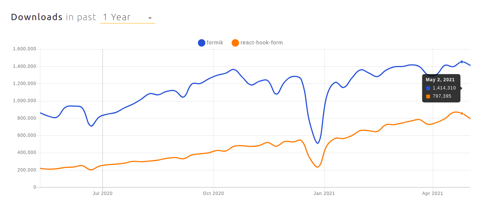
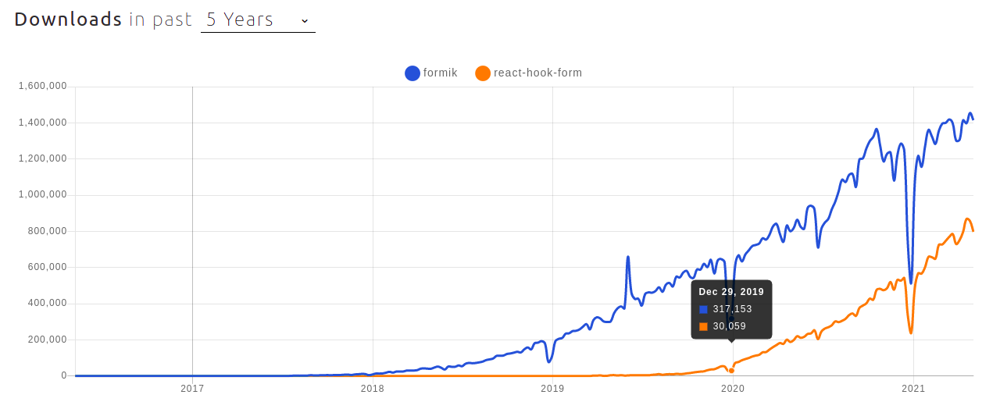
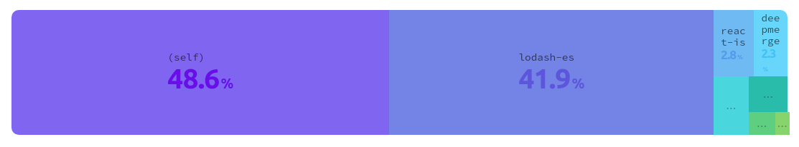
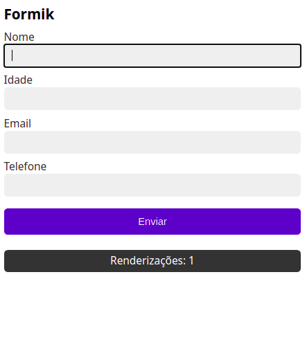
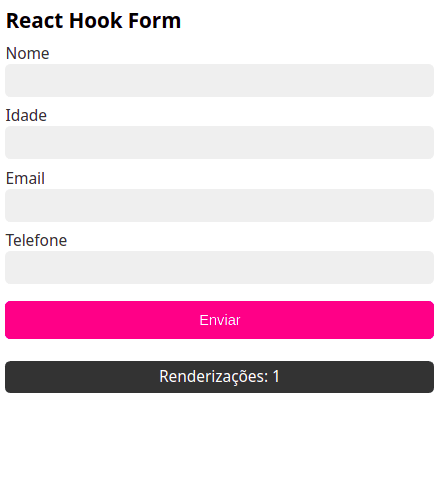
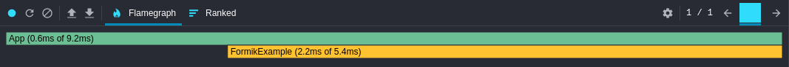
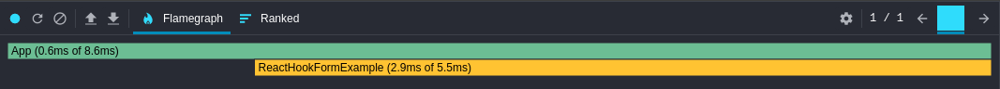

# Formik vs React Hook Form

Um comparativo das duas libs de formulários React mais utilizadas até o momento.

## Introdução

Aqueles que já desenvolveram formulários no React através de [Controlled Components](https://reactjs.org/docs/forms.html#controlled-components) sabem o quanto pode ser trabalhoso armazenar os valores dos campos em estados. A adição de máscaras e validações então só aumentam as linhas de código e quantidade de renderizações do formulário.

Para resolver problemas como esse foram surgindo diversas libs de formulários React ao longo dos anos. Nesse artigo serão comparadas [as duas mais utilizadas até o momento](https://www.npmtrends.com/redux-form-vs-formik-vs-react-hook-form-vs-react-final-form),  [Formik](https://formik.org/) e [React Hook Form](https://react-hook-form.com/). Como critérios de comparação considerou-se o tamanho de cada uma, a quantidade de downloads, o número de dependências, performance, dentre outros. Ao final será apresentado um exemplo prático com a criação de um formulário contendo nome, idade, email e telefone, aplicando máscaras e validações.

## Comparativo Técnico

O comparativo técnico foi desenvolvido com base na análise de dados do [npm trends](https://www.npmtrends.com/formik-vs-react-hook-form), [BundlePhobia](https://bundlephobia.com/), e dos próprios repositórios e sites das libs.

### Quantidade de downloads

Abaixo é apresentado um gráfico com a quantidade de downloads das libs por semana no período de um ano.



Como se pode notar, com pouco mais de 1.400.000 downloads semanais a Formik apresenta maior popularidade se comparada aos quase 800.000 downloads da React Hook Form. Considerando esse período de um ano, pode-se concluir que ambas possuem um índice bem próximo de crescimento, sendo que um ano atrás a Formik apresentava aproximadamente 865.000 e a React Hook Form 220.000. Na tabela abaixo podemos comparar os dados mais precisamente.

|             |  Formik   | React Hook Form |
| ----------- | :-------: | :-------------: |
| Atualmente  | 1.414.310 |     797.395     |
| 1 ano atrás |  864.294  |     220.554     |
| Crescimento |  550.016  |     576.841     |

**Curiosidade:** Eu me perguntei o porquê dessa queda brusca na quantidade de downloads no gráfico no período entre Dezembro e Janeiro. Então aumentei o período para 5 anos, e reparei que o mesmo comportamento se repetia, mais precisamente nas semanas do dia 23 de Dezembro ao dia 1 de Janeiro. Não é coincidência que sejam períodos em que se comemoram o Natal e Ano Novo.



### Informações do Github

Por algum motivo o npm trends não estava apresentando os dados referentes a stars, forks, issues e updated. Por isso optei por buscar os dados diretamente em cada repositório.

|               | Formik | React Hook Form |
| ------------- | :----: | :-------------: |
| Watch         |  241   |       157       |
| Star          | 27.2k  |      20.7k      |
| Fork          |  2.2k  |       939       |
| Issues        |  505   |        1        |
| Pull requests |  100   |        9        |

Novamente aqui a Formik demonstra uma maior popularidade considerando a quantidade de watches, stars e forks. Entretando a React Hook Form não fica para trás, com índices bem satisfatórios. O que chama a atenção são as 505 isues em aberto da primeira contra apenas 1 da segunda. Mesmo sabendo da popularidade da Formik perante a React Hook Form, os índices de Issues são bem discrepantes.

### Integração e suporte

Analisando a documentação das libs é possível ver que ambas apresentam suporte e integração com diversas outras linguagens, ferramentes do mundo Front-end.

|              | Formik | React Hook Form |
| ------------ | :----: | :-------------: |
| Typescript   |  Sim   |       Sim       |
| React Native |  Sim   |       Sim       |
| Redux        |  Sim   |       Sim       |
| Material UI  |  Sim   |       Sim       |
| Yup          |  Sim   |       Sim       |

### Tamanho do bundle e composição de dependências

Ao adicionar qualquer dependência em seu projeto, um fator importante a se considerar é o tamanho dela e quais outras dependências serão adicionadas para o seu funcionamento. Isso porque elas se juntarão ao bundle final da sua aplicação, caso ela seja uma dependência para produção. Os dados abaixo são do site BundlePhobia, e apresentam o tamanho do bundle e a composição de dependências de cada lib.

##### Tamanho do bundle

|                    | Formik | React Hook Form |
| ------------------ | :----: | :-------------: |
| minified           | 44.4k  |     24.9kb      |
| minified + gzipped | 13.1kb |      8.5kb      |

##### Composição de dependências da Formik



##### Composição de dependências da React Hook Form


Pode-se concluir que a React Hook Form venceu em ambas as métricas, tanto no tamanho do bundle, apresentando uma diferença de quase 5kb a menos se comparada com a Formik, quanto na composição de módulos, apresentando 0 dependências contra 7 da Formik.

------

## Comparativo de desenvolvimento

A Formik e a React Hook Form seguem diferentes formas de implementação de formulários. O objetivo dessa métrica não é pontuar qual das duas formas é a melhor, já que cada desenvolvedor tem a sua preferência. A ideia aqui é criar um formulário de acordo com uma determinada lista de requisitos, e mostrar como tratá-los utilizando cada uma. Abaixo é apresentado uma tabela com os inputs e suas devidas validações:

| Campo    | Tipo  | Requisitos                                  |
| :------- | :---- | :------------------------------------------ |
| Nome     | text  | obrigatório                                 |
| Idade    | text  | obrigatório, maior que 10                   |
| Email    | email | obrigatório, com formato válido de email    |
| Telefone | tel   | obrigatório, com formato válido de telefone |

### Desenvolvendo um formulário com a lib Formik

A Formik apresenta duas formas de se desenvolver um formulário, a primeira utilizando os componentes [Formik](https://formik.org/docs/api/formik), [Form](https://formik.org/docs/api/form), e [Field](https://formik.org/docs/api/field), e a segunda utilizando o hook [useFormik()](https://formik.org/docs/api/useFormik). Nesse comparativo eu optei pela utilização do hook pela forma como a implementação se assemelha a criação de um formulário padrão no React.

Para começar é necessário instalar a dependência utilizando `npm install formik` ou `yarn add formik`. Após isso nós criamos um componente e adicionamos o seguinte trecho de código:

```tsx
import React from 'react'
import { useFormik, FormikErrors, FormikValues } from 'formik'
import { validateEmail, validatePhone } from 'src/utils/validations'

const FormikExample = () => {
  const inputNames: FormikValues = {
    name: 'Nome',
    age: 'Idade',
    email: 'Email',
    phone: 'Telefone'
  }
  const { handleSubmit, handleChange, values, errors } = useFormik({
    initialValues: {
      name: '',
      age: '',
      email: '',
      phone: ''
    },
    onSubmit: (formValues) => {
      console.log('values', formValues)
    },
    validate: (values: FormikValues) => {
      const errors: FormikErrors<FormikValues> = {}

      Object.keys(values).forEach(key => {
        if (!values[key]) {
          errors[key] = `${inputNames[key]} é um campo obrigatório`
        } else {
          if (key === 'age' && parseInt(values[key]) <= 10) {
            errors[key] = 'A idade deve ser maior que 10'
          }
          if (key === 'email' && !validateEmail(values[key])) {
            errors[key] = 'O email digitado é inválido'
          }
          if (key === 'phone' && !validatePhone(values[key])) {
            errors[key] = 'O número de telefone digitado é inválido'
          }
        }
      })

      return errors
    }
  })

  [...]
}

```

Ao iniciar o `useFormik()` nós passamos as seguintes propriedades:

- `initialValues`: recebe um objeto contendo o nome e o valor inicial de cada campo do formulário.
- `onSubmit`: recebe um método que será chamado quando o formulário for enviado
- `validate`: recebe um método responsável por realizar a validação dos campos, e retornar um objeto com os erros.

E com ele podemos obter as seguintes variáveis e métodos:

- `values`: objeto com os valores dos campos do formulário
- `errors`: objeto com os erros de validação dos campos do formulário
- `handleSubmit`: método responsável por tratar o envio do formulário
- `handleChange`: método responsável por tratar os eventos de mudanças dos campos

Para fazer o tratamento das máscaras temos que criar um método que será chamado a cada mudança nos campos do formulário. Caso ele receba por parâmetro uma função para formatação de valor, então ele pega esse valor formatado, o altera no ChangeEvent, e o envia para o handleChange disponibilizado pelo `useFormik()`.

```tsx
import React, { ChangeEvent } from 'react'

const FormikExample = () => {
  [...]

  function onChange (event: ChangeEvent<HTMLInputElement>, mask?: (value: string) => string){
    if (mask) {
      const newEvent = event
      newEvent.target.value = mask(event.target.value)
      handleChange(newEvent)
    } else {
      handleChange(event)
    }
  }

  [...]
}

```

Por fim nós criamos os campos do formulário passando as funções de formatação para os que precisam de máscara.

```tsx
import React from 'react'
import { maskPhone, onlyNumber } from 'src/utils/masks'

const FormikExample = () => {
  [...]

  return (
    <form className='form formik' onSubmit={handleSubmit}>
      <header>
        <h3>Formik</h3>
      </header>
      <div>
        <label htmlFor='name'>Nome</label>
        <input
          type='text'
          id='name'
          name='name'
          value={values.name}
          onChange={onChange}
        />
        <span className='error'>{errors.name}</span>
      </div>
      <div>
        <label htmlFor='age'>Idade</label>
        <input
          type='text'
          id='age'
          name='age'
          inputMode='numeric'
          value={values.age}
          onChange={(event: ChangeEvent<HTMLInputElement>) => onChange(event, onlyNumber)}
        />
        <span className='error'>{errors.age}</span>
      </div>
      <div>
        <label htmlFor='email'>Email</label>
        <input
          type='email'
          id='email'
          name='email'
          value={values.email}
          onChange={onChange}
        />
        <span className='error'>{errors.email}</span>
      </div>
      <div>
        <label htmlFor='phone'>Telefone</label>
        <input
          type='tel'
          id='phone'
          name='phone'
          value={values.phone}
          onChange={(event: ChangeEvent<HTMLInputElement>) => onChange(event, maskPhone)}
        />
        <span className='error'>{errors.phone}</span>
      </div>
      <button type='submit'>Enviar</button>
    </form>
  )
}
```

Para o desenvolvimento do formulário foram necessárias ao todo 117 linhas de código. Você pode ver o código completo [nesse link](https://github.com/thiagosalome/formik-vs-react-hook-form/blob/master/src/components/FormikExample.tsx).

### Desenvolvendo um formulário com a lib React Hook Form

Da versão 6 para a versão 7 do React Hook Form ocorreram algumas mudanças no registro e no recebimento de erros dos campos. Abaixo vocês podem ver a diferença:

```tsx
// Versão 6
const { register, errors } = useForm()
<input
  type='text'
  name='name'
  ref={register({
    required: 'Nome é um campo obrigatório'
  })}
/>
errors.name?.message

// Versão 7
const { register, formState: { errors } } = useForm()
<input
  type='text'
  {...register('name', {
    required: 'Nome é um campo obrigatório'
  })}
/>
errors.name?.message
```

Nesse comparativo utilizaremos a última versão lançada. Você pode instalá-la utilizando `npm install react-hook-form` ou `yarn add react-hook-form`.

O React Hook Form disponibiliza um hook chamado [useForm()](https://react-hook-form.com/api/useform). Para o desenvolvimento do formulário nós vamos criar um componente e fazer da seguinte forma:

```tsx
import React from 'react'
import { useForm } from 'react-hook-form'

const ReactHookFormExample = () => {
  const { register, handleSubmit, formState: { errors }, setValue } = useForm()

  [...]
}
```

- `register`: método que faz o registro de todos os campos do formulário
- `handleSubmit`: método responsável por tratar o envio do formulário
- `errors`: objeto com os erros de validação dos campos do formulário
- `setValue`: método que muda os valores de um ou mais campos do formulário

Após isso nós criamos o nosso formulário, fazendo o registro dos campos. O método `setValue` é utilizado para fazer a aplicação das máscaras.

```tsx
import React from 'react'
import { useForm } from 'react-hook-form'
import { maskPhone, onlyNumber } from 'src/utils/masks'
import { validateEmail, validatePhone } from 'src/utils/validations'

const ReactHookFormExample = () => {
  const { register, handleSubmit, formState: { errors }, setValue } = useForm()

  return (
    <form className='form react-hook-form' onSubmit={handleSubmit(submitForm)}>
      <header>
        <h3>React Hook Form</h3>
      </header>
      <div>
        <label htmlFor='name'>Nome</label>
        <input
          type='text'
          id='name'
          {...register('name', {
            required: 'Nome é um campo obrigatório'
          })}
        />
        <span className='error'>{errors.name?.message}</span>
      </div>
      <div>
        <label htmlFor='age'>Idade</label>
        <input
          type='text'
          id='age'
          inputMode='numeric'
          {...register('age', {
            required: 'Idade é um campo obrigatório',
            min: {
              value: 11,
              message: 'A idade deve ser maior que 10'
            }
          })}
          onChange={(event: ChangeEvent<HTMLInputElement>) => setValue('age', onlyNumber(event.target.value))}
        />
        <span className='error'>{errors.age?.message}</span>
      </div>
      <div>
        <label htmlFor='email'>Email</label>
        <input
          type='email'
          id='email'
          {...register('email', {
            required: 'Email é um campo obrigatório',
            validate: {
              isEmail: value => validateEmail(value) || 'O email digitado é inválido'
            }
          })}
        />
        <span className='error'>{errors.email?.message}</span>
      </div>
      <div>
        <label htmlFor='phone'>Telefone</label>
        <input
          type='tel'
          id='phone'
          {...register('phone', {
            required: 'Telefone é um campo obrigatório',
            validate: {
              isPhone: value => validatePhone(value) || 'O número de telefone digitado é inválido'
            }
          })}
          onChange={(event: ChangeEvent<HTMLInputElement>) => setValue('phone', maskPhone(event.target.value))}
        />
        <span className='error'>{errors.phone?.message}</span>
      </div>
      <button type='submit'>Enviar</button>
      <div className='rendering'>
        Renderizações: {renderingCounter}
      </div>
    </form>
  )
}
```

Como vocês podem observar, as validações são criadas dentro de um objeto passado para o método  `register()`. O React Hook Form já disponibiliza algumas propriedades para validações, como o `required` para campos obrigatórios, e o `min` para validação de números mínimos, bem semelhante [a forma padrão de validação de formulários no HTML](https://developer.mozilla.org/en-US/docs/Learn/Forms/Form_validation#using_built-in_form_validation). Para casos mais específicos como validação de email e telefone há a propriedade `validate`.

O desenvolvimento desse formulário gerou ao todo 95 linhas de código, que você pode visualizar [nesse link](https://github.com/thiagosalome/formik-vs-react-hook-form/blob/master/src/components/ReactHookFormExample.tsx).

------

## Comparativo de performance

Um ponto importante a se considerar no desenvolvimento de qualquer componente React é a sua performance. E para medi-la nos formulários criados na seção anterior, foram definidas duas métricas principais: a quantidade de renderizações que cada formulário terá enquanto o usuário estiver preenchendo-o, e o tempo gasto na primeira renderização do formulário em tela.

Para saber a quantidade de renderizações de cada componente, eu criei uma variável com valor inicial 0 que incrementava a cada vez que formulário renderizava. Abaixo nós podemos ver o resultado de cada um:

### Formik - Quantidade de renderizações



### React Hook Form - Quantidade de renderizações



Aqui claramente podemos ver que em termos de quantidade de renderização a React Hook Form se destaca se comparada a Formik, tendo apenas 1 contra 74.

Para calcular o tempo que cada componente leva para ser renderizado na primeira vez, eu utilizei a funcionalidade de Profiler disponibilizada pela extensão [React Developer Tools](https://chrome.google.com/webstore/detail/react-developer-tools/fmkadmapgofadopljbjfkapdkoienihi).

### Formik - Tempo gasto na primeira renderização



### React Hook Form - Tempo gasto na primeira renderização



Com uma diferença de 0.7ms, a Fomik se destaca sobre a React Hook Form no tempo gasto na primeira renderização. É importante ressaltar que esses dados podem variar de acordo com o tamanho do formulário desenvolvido.

------

## Resultado

Abaixo você pode ver o resultado do desenvolvimento e comparar a quantidade de renderizações presentes em cada tipo de formulário. Como extra adicionei um formulário desenvolvido utilizando o conceito de Controlled Components.

[Link do projeto](https://thzmo.csb.app/)

## Conclusão

Se comparada a forma padrão de desenvolvimento de formulários no React, ambas as libs trazem muitas vantagens. O seu código fica mais enxuto, e você não tem que se preocupar em ficar armazenando os valores em estados. Então no que se refere a parte de desenvolvimento, considero as duas empatadas, por tornarem esse processo mais fácil e por apresentarem uma documentação simples e objetiva.

Já se levarmos em conta o comparativo técnico e de performance, a React Hook Form leva a melhor por ser menor, não conter nenhuma outra dependência externa, e evitar renderizações nas mudanças de valores dos campos, oferecendo mais vantagens do que a Formik.

## Referências

- [Looking for the Best React Form Library in 2021? It’s Probably on This List](https://dev.to/pmbanugo/looking-for-the-best-react-form-library-in-2021-it-s-probably-on-this-list-e2h)
- [The Best React Form Library To Use In 2020](https://frontend-digest.com/the-best-react-form-library-to-use-in-2020-11e93c267e4)
- [React Hook Form vs. Formik: A technical and performance comparison](https://blog.logrocket.com/react-hook-form-vs-formik-a-technical-and-performance-comparison/)
- [React Hook Form VS Formik](https://blog.bitsrc.io/react-hook-form-vs-formik-form-builder-library-for-react-23ed559fdae)
- [Formik VS React Hook Form Part I](https://dev.to/doaashafik/formik-vs-react-hook-form-aei)
- [Formik vs React-hook-form Cases Part II](https://dev.to/doaashafik/formik-vs-react-hook-form-cases-part-ii-3ofj)
